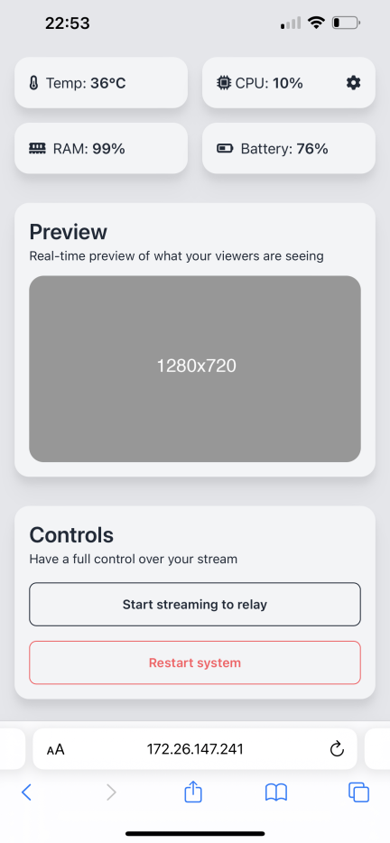

# tesla-streamer
IRL streaming backpack software optimized for MacBooks, delivering seamless live video and audio streaming on the go

## Features
- [x] Stream live video and audio from your MacBook to a relay server, from where you can do anything you want with the stream (e.g. broadcast it to Twitch, YouTube, etc.)
- [x] H265, H264, and VP8 video encoding
- [x] AAC and Opus audio encoding
- [x] Low latency streaming
- [x] Ultra low battery consumption

## Requirements
- [x] macOS 10.13 or later
- [x] Recommended: Apple Silicon Mac (M1 or later) for best performance and battery life
- [x] A good internet connection (LTE/5G)
- [x] A computer at house that will receive the stream, and eventually broadcast it to Twitch, YouTube, etc.

## Preview of mobile panel

## How to use
- This project is a work in progress. If you want to contribute, feel free to open a pull request.
